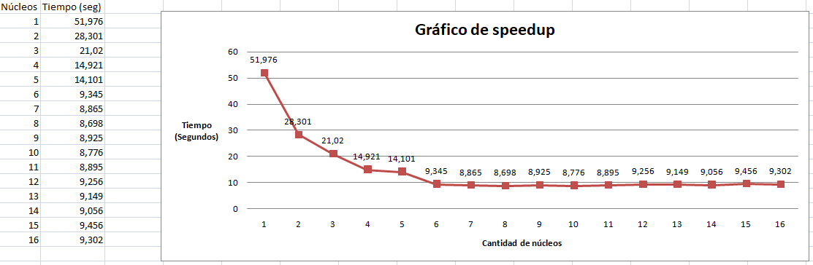

# n-sudoku
Implementación de parallelsudoku para el cluster de la UCN en C++
# Resultados

# Conclusiones
* A medida que se añaden núcleos el tiempo comienza a decaer exponencialmente.
* A partir del sexto núcleo se puede ver cómo la velocidad va variando pero siempre manteniéndose entre 8 y 9 segundos.
* Esto quiere decir que alcanza una estabilidad y una velocidad de procesamiento constante para este problema, por lo que se puede decir que con un sexto núcleo ya no puede seguir mejorando la solución.
